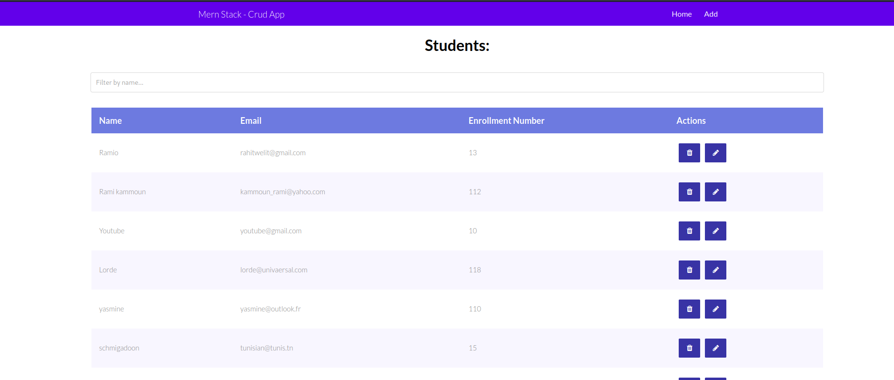
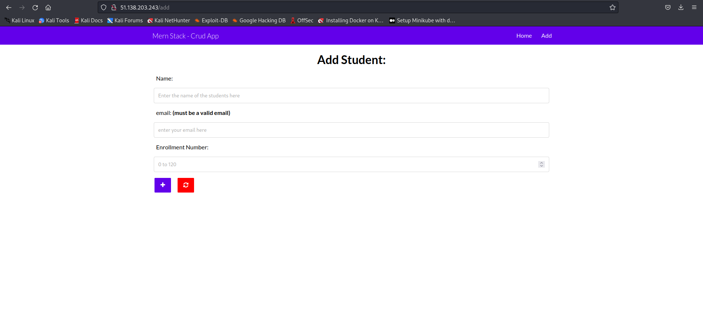
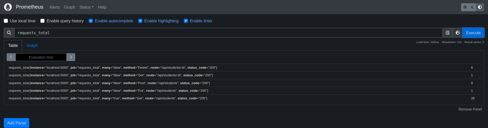
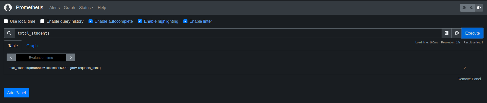
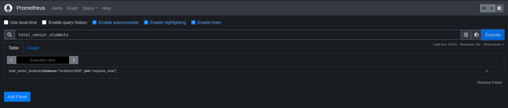

# DevOps 
This lab is part of the __GL5__ last year's __project__ in the following subjects :
- DevOps
- Automation
- Deployment

The application that will be showcased is a simple version of a students enrollement application that manages the __subscription of students__ in school by the administration. It's a __frontend/backend__ with simple CRUD features:
<ol>
<li>Fetching the list of All Students</li>
<li>Fetching the information of a single student</li>
<li>Adding a new student</li>
<li>Editing the information of a new student</li>
<li>Deleting an existing student</li>
</ol>
The application uses a MongoDB database that is already deployed on the cloud. You can access the website by clicking on this [Link](http://expressjs.com/)





## Observibility
***
## 1. Metrics

With the definition of the ability to understand the internal state of a system in DevOps. In the section we will getting deeper in the pillars of observabilities applied on this project. 

#### Metrics

In our application, metrics are used to monitor and track the performance, availability, and overall health of our system. 
```
const requestCounter = new client.Counter({
    name: 'requests_total',
    help: '\n The total number of requests handled by the server',
    labelNames: ['method','route','status_code','many']
});

const total_Students = new client.Gauge({
    name: 'total_students',
    help: '\n Total number of students',
  });

const total_senior_students = new client.Gauge({
    name: 'total_senior_students',
    help: '\n Total number of senior students',
  });
```
As shown on the piece of code above, in our metrics we have __one counter__ and __two gauges__. The __requestCounter__ is for counting the total number of requests incoming to our application and the other two are for implementing business metrics such as __the total number of students__ and __the number of senior students__ who have a number of enrollement greater than 100.

When we add the path ``/metrics`` to our ``server.js`` after importing ``prom-client`` we get the following result: 


We can see the __counters__ and __Gauges__ discussed above.

Other ways to perform our metric visualization for better analytics are ``Prometheus`` and ``Grafana``. 


In the screen above, we can see the result of Prometheus after we passed the __requests_total__ counter.


In the screen above, we can see the result of Prometheus after we passed the __total_students__ Gauge.


In the screen above, we can see the result of Prometheus after we passed the __total_senior_students__ Gauge.

