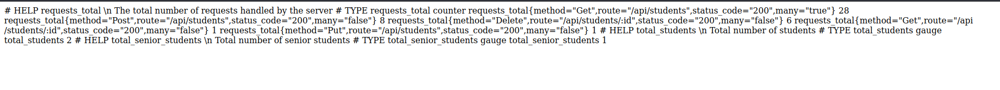

# DevOps 
This lab is part of the __GL5__ last year's __project__ in the following subjects :
- DevOps
- Automation
- Deployment

The application that will be showcased is a simple version of a students enrollement application that manages the __subscription of students__ in school by the administration. It's a __frontend/backend__ with simple CRUD features:
<ol>
<li>Fetching the list of All Students</li>
<li>Fetching the information of a single student</li>
<li>Adding a new student</li>
<li>Editing the information of a new student</li>
<li>Deleting an existing student</li>
</ol>
The application uses a MongoDB database that is already deployed on the cloud. You can access the website by clicking on this [Link](http://51.138.203.243/)


## Observibility
***
## 1. Metrics

With the definition of the ability to understand the internal state of a system in DevOps. In the section we will getting deeper in the pillars of observabilities applied on this project. 

#### Metrics

In our application, metrics are used to monitor and track the performance, availability, and overall health of our system. 
```js
const requestCounter = new client.Counter({
    name: 'requests_total',
    help: '\n The total number of requests handled by the server',
    labelNames: ['method','route','status_code','many']
});

const total_Students = new client.Gauge({
    name: 'total_students',
    help: '\n Total number of students',
  });

const total_senior_students = new client.Gauge({
    name: 'total_senior_students',
    help: '\n Total number of senior students',
  });
```
As shown on the piece of code above, in our metrics we have __one counter__ and __two gauges__. The __requestCounter__ is for counting the total number of requests incoming to our application and the other two are for implementing business metrics such as __the total number of students__ and __the number of senior students__ who have a number of enrollement greater than 100.

When we add the path ``/metrics`` to our ``server.js`` after importing ``prom-client`` we get the following result: 



We can see the __counters__ and __Gauges__ discussed above.

Other ways to perform our metric visualization for better analytics are ``Prometheus`` and ``Grafana``. 


In the screen above, we can see the result of Prometheus after we passed the __requests_total__ counter.


In the screen above, we can see the result of Prometheus after we passed the __total_students__ Gauge.


In the screen above, we can see the result of Prometheus after we passed the __total_senior_students__ Gauge.

Then, for better visualization, we use ``Grafana`` which is an open-source tool for visualizing and analyzing metrics, such as time-series data from monitoring and logging systems.

In the picture down below, we can visualize our daily metrics of monitoring our requests in timeseries graphs, line and pie chart. 


**Business Logic :** My application is about students enrollement. So, the business logic is represented in the fact that we need to know __the number of senior student__ when comparing it to the total number of students. 


In the screen above we can see the ratio between the *total_students* and *total_senior_students* is *50%*.

Finally, the counter was labeled by ``method, route, status and whether it fetches multiple data or not.``
```js
labelNames: ['method','route','status_code','many']
```

## 2. Logs

Logs are a necessary part of our application, 
At the beginning we need to define a logger and then implement it locally within our routes to make sure that it's functionning well.

For our application, we defined Logs in two ways, the first one locacally in the phase of implementing our application and the second one by using a platform called __Datadog__ used for logs and traces and monitoring the different states of our applications using dashbaords.

In order for the logs to work, we need to integrate them into our code this way:
```js
const rootLogger = createLogger({
    level: 'info',
    exitOnError: false,
    format: format.combine(
        format.timestamp(),
        format.json(),
    ),
    transports: [
      new transports.File({ filename: './logs/student.log' }),
      new transports.Console(),
    ],
});
```
then
```js
rootLogger.info('Get the list of all students', {request_id: reqID, user_ip: ip});
```


In the screen above, we have tested the logs to be recorded locally, ``a method that's storage intensive``. 

I made sure to include the ``request_id`` and ``user_ip`` into our logs.

In the screens after, I installed datadog agent within my cluster and it was linked through the datadog servers and here is the impressive results. 

When sending a request to our server for ``fetching the list`` of all the students.

When sending a request to our server for ``deleting a student`` of all the students.

When sending a request to our server for ``Failing to add a new student`` of all the students.

When looking at the screens above, we can notice that we have added the ``request_id``, the ``user_ip`` and even the ``student_id`` in some cases.

## 3. Traces using OpenTlemetry 
## 4. Helm 

# Automation

For the automation I used 3 stacks in Terraform

__Terraform__ is an IaaC tool that allows us to provision and manage cloud resources using code.

1. __First Stack :__ For the first stack, we provisioned our AKS cluster and the resource group it belongs to.

2. __Second Stack :__ For the second stack, a setup for our webapp using Kubernetes provider as well as Helm provider.

3. __Third Stack :__ For the third stack, we provisioned our Ingress resource in order to ensure the load balancing between our two services, the frontend and the backend.

# Deployment

In our application, we only have two microservices:
- Front-End microservice
- Back-end microservice
Both of them were deployed by being built by Docker, then pushed in the Docker Hub and eventually being deployed on our Kubernetes cluster in Microsoft Azure.

In the follwing images, you will find the different .yaml files that we had to create in that same preserved order.


### Application Deployment Architecture

__Helm Chart__ was used for doployment purposes.


### Deployement Strategy
During the applying of Terraform, I tried to make ArgoCD work for my deployment strategy but problems took place and I couldn't fix the bugs so I didn't implement any deployment strategy. 

__Hypothetically speaking :__ If I were to choose a deployment strategy i would choose __blue/green__ because:
- It offers zero-downtime deployment
- We can rollback to a previous version in case of an issue in the new version.

Generally speaking, my application is offered to students who need it to be available the whole time everyday so having an application that's down is not ideal. 
And the last reason is for its ``easy scalability``.

- __Easy Scaling :__ We can scale one environment while the other is serving traffic, and then switch traffic to the newly scaled environment. 

In times of school comeback, it is crucially necessary to have an application that can resist high trafficking at times. 
